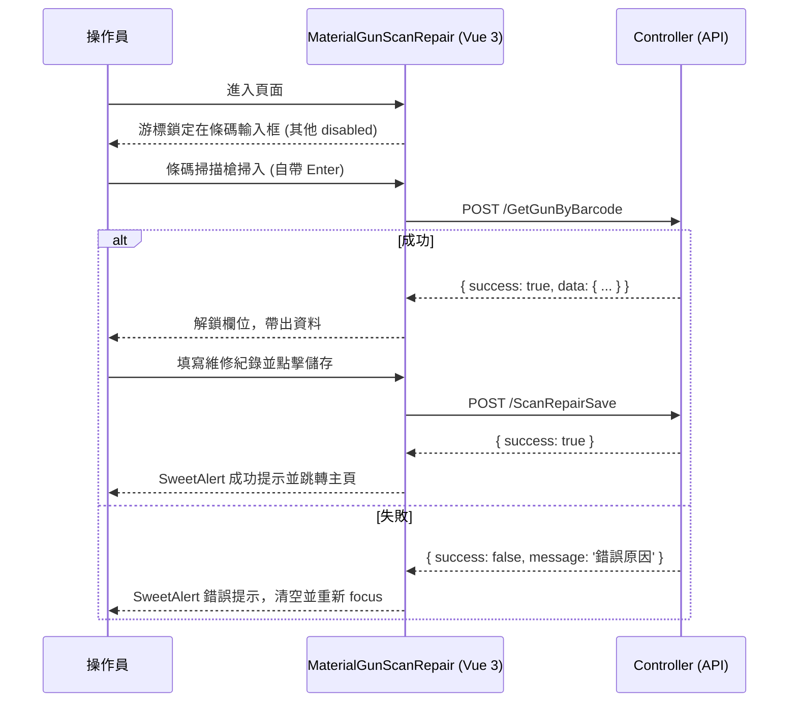

# MVP 規格書：料槍維修條碼化輸入與權限控管變更

**文件日期**：2026-06-04
**版本**：v1.0 (MVP)
**系統**：昶亨整合式系統 (ESIntegrateSys)

---

## 1. MVP 目標與成功標準

### 1.1 目標
以最少的改動，解決料槍維修作業中「選錯料槍」的人為失誤問題，並鎖定特定人員才能對已完修資料進行再次編輯。

### 1.2 成功標準
1. **防錯機制生效**：掃描條碼自動帶出料槍資料；查無資料或已完修時，系統攔截並顯示錯誤提示。
2. **作業效率提升**：操作人員不需手動輸入料槍編號，直接掃描即可解鎖編輯欄位。
3. **權限控管精確**：非白名單人員無法在主頁清單中點擊/操作「已完修」狀態的維修按鈕。
4. **系統無痛整合**：新頁面 (Vue 3 CDN) 與既有頁面 (jQuery) 共存，不破壞現有架構。

---

## 2. 現況系統概述（簡要）

* **架構**：ASP.NET MVC 5.2.7 + .NET Framework 4.5
* **前端**：Bootstrap 3.4.1 + jQuery 3.4.1 + Razor Views
* **資料庫**：SQL Server (EF 6 Database First 用於 CRUD，ADO.NET 用於複雜查詢)
* **痛點**：
  * 料槍維修需手動輸入編號，易選錯料槍。
  * 「已完修」的料槍維修按鈕任何人皆可點擊。
  * 權限控管機制不統一。

---

## 3. 需求總覽

### 3.1 MVP 必須完成的功能
* 新增「掃碼維修」頁面 (`MaterialGunScanRepair.cshtml`)。
* 條碼掃描後端驗證 API (`GetGunByBarcode`)。
* 掃描成功自動帶出基礎資料並解鎖編輯欄位。
* 統一錯誤提示 (SweetAlert2)。
* 主頁 (`MaterialGunRepairView.cshtml`) 新增「掃碼維修」入口按鈕。
* 針對「已完修」維修按鈕的前端顯示與後端權限控管 (基於 `Web.config` 白名單)。

### 3.2 MVP 絕對不做的功能
* 白名單後台動態管理頁面（初期僅使用 `appSettings`）。
* 開發專屬 App 或 PWA。
* 即時狀態推播通知。
* 維修流程的複雜狀態機或多階段審核。
* 歷史維修數據報表或圖表。
* 批次掃碼功能（一次處理多筆）。
* 全系統權限 (RBAC) 重構或 Serilog 統一日誌導入。

---

## 4. 使用者角色與權限

| 角色 | 權限範圍說明 | MVP 控管方式 |
|------|-------------|--------------|
| 一般操作員 / 維修員 | 可進入「掃碼維修」頁面新增維修紀錄。只能操作「未完修」的料槍維修按鈕。 | 前端隱藏/停用已完修按鈕，後端攔截非授權操作。 |
| 特權維修員 (白名單) | 擁有一般權限，且**可以**點擊與操作「已完修」的料槍維修按鈕。 | 比對 `Session["Member"].fUserId` 與 `Web.config` 的 `RepairPrivilegedUsers` 設定。 |

---

## 5. 功能需求詳細描述

### 5.1 F1: 掃碼維修頁面 (`MaterialGunScanRepair.cshtml`)
* **框架**：使用 Vue.js 3 CDN (`createApp`) 管理狀態。
* **行為**：
  * 頁面載入時，焦點 (Focus) 自動鎖定在「料槍條碼輸入框」。
  * 除條碼輸入框外，其餘編輯欄位 (檢修不良分類、原因、更換部品等) 預設為 `disabled`。
* **防呆**：若未掃描成功，無法手動解鎖欄位。

### 5.2 F2 & F3: 條碼驗證與欄位自動帶出
* **觸發**：監聽輸入框的 `Enter` 鍵 (`@keydown.enter`)。
* **流程**：
  1. 前端阻擋空白提交。
  2. 呼叫 API `POST /MaterialGun/GetGunByBarcode`。
  3. API 回傳成功：解鎖編輯欄位，自動將回傳的 JSON 資料綁定 (v-model) 至畫面欄位。
  4. API 回傳失敗：觸發 F4 錯誤提示。

### 5.3 F4: 統一錯誤提示
* **套件**：SweetAlert2 (`Swal.fire`)。
* **情境**：
  * 查無此料槍。
  * 該料槍已處於維修中或已完修狀態 (視業務邏輯限制)。
* **後續動作**：關閉提示後，自動清空輸入框並重新 `focus()`。

### 5.4 F5 & F6: 儲存與主頁入口
* **入口**：在 `MaterialGunRepairView.cshtml` 的上方工具列加入 `[ 掃碼維修 ]` 按鈕，連結至 `MaterialGunMaterialGunScanRepair`。
* **儲存**：在 `MaterialGunScanRepair.cshtml` 點擊儲存，呼叫 `POST /MaterialGun/ScanRepairSave`，成功後 `Swal.fire` 提示並於 1.5 秒後跳轉回 `MaterialGunRepairView` 主頁。

### 5.5 F7 & F8: 特權維修權限控管
* **前端 (F8)**：在 `MaterialGunRepairView.cshtml` 渲染資料列時，判斷若 `Chk` 為 0 (已完修) 且當前登入者不在白名單內，則不渲染維修 `<a>` 連結，或將其改為唯讀樣式 (如 `disabled`)。
* **後端 (F7)**：在接收已完修資料的編輯/儲存請求時 (對應的原 Action)，需讀取 `ConfigurationManager.AppSettings["RepairPrivilegedUsers"]`，若當前 Session 者不在白名單中，回傳 `403 Forbidden` 或錯誤視窗。

---

## 6. 畫面與操作流程

### 6.1 掃碼維修流程


---

## 7. 資料結構與 API

### 7.1 API: `GetGunByBarcode`
* **Method**: POST
* **URL**: `/MaterialGun/GetGunByBarcode`
* **Request**: `{ "barcode": "string" }`
* **Response**:
  ```json
  {
    "success": true,
    "message": "",
    "data": {
      "MaterialGun_Eno": "EQ-001",
      "MaterialGun_Sno": "SN123",
      "MaterialGun_Trade": "BrandX",
      "MaterialGun_Size": "TypeA"
      // 其他所需欄位
    }
  }
  ```

### 7.2 API: `ScanRepairSave`
* **Method**: POST
* **URL**: `/MaterialGun/ScanRepairSave`
* **Request**: 表單 ViewModel 或 JSON
* **Response**: `{ "success": true, "message": "儲存成功" }`

---

## 8. 技術債底線 (MVP 規範)

### 8.1 絕對不能的做法
1. **不能硬編碼密碼或鍵值**：絕對禁止在 C# 中寫死 `if (userId == "02898")`。
2. **不能省略後端權限驗證**：不能只在 Razor 視圖中使用 `if` 隱藏按鈕，後端 Action 必須同步檢查。
3. **不能使用不安全 SQL**：禁止字串拼接 SQL，防範 SQL Injection。
4. **不能缺少錯誤處理**：API 發生錯誤不能直接拋出 500 YSOD (Yellow Screen of Death)。

### 8.2 必須遵守的規範
1. **必須使用設定檔**：權限白名單必須寫在 `Web.config` 的 `<appSettings>`，以逗號分隔。
2. **必須使用參數化查詢**：新增的 API 查詢必須使用 Dapper 的 `@Param` 語法或 Entity Framework。
3. **必須統一日誌**：即使未導入 Serilog，所有的 catch 區塊必須將 Exception 紀錄至現有的 `Logs/` 機制。
4. **統一回傳格式**：所有 AJAX API 必須回傳標準 `{ success, message, data }` 結構。

---

## 9. 擴充方向 (未來版本 v1.1+)

1. **白名單動態管理**：開發專屬後台頁面，將 `appSettings` 移至 DB 管理。
2. **全面 RBAC 整合**：將此特權邏輯整合至 `ES_MemberRole` 與 `ES_MemberFunction`。
3. **保養排程連動**：掃碼維修後，自動重算並更新 `MaintainNexDate`。
4. **全域前端升級**：以此頁面為基礎，逐步將其他 jQuery 頁面改寫為 Vue 3 CDN。

---

## 10. 驗收標準

1. **環境準備**：配置好 USB/藍牙條碼掃描槍 (設定為後綴帶 Enter)。
2. **測試案例 1 (正常掃碼)**：
   * 進入 `/MaterialGun/MaterialGunMaterialGunScanRepair`。
   * 掃入存在且可維修的條碼。
   * 預期：無錯誤彈窗，欄位解鎖並帶出正確資料。
3. **測試案例 2 (異常掃碼)**：
   * 掃入不存在的條碼。
   * 預期：SweetAlert 提示「查無料槍」，關閉後游標回到輸入框，欄位保持 disabled。
4. **測試案例 3 (權限驗證 - 白名單內)**：
   * 使用 `02898` 帳號登入。
   * 進入主頁查詢清單，找到已完修 (`Chk=0`) 資料。
   * 預期：可看見並點擊維修按鈕，後端儲存不報錯。
5. **測試案例 4 (權限驗證 - 白名單外)**：
   * 使用非 `02898` 帳號登入。
   * 預期：主頁查詢清單中，已完修資料的維修按鈕不可見或為唯讀。若強行存取該記錄編輯網址，後端回傳 403 錯誤。

---

## 11. 待確認問題

無（需求已明確界定於 MVP 範圍內）。

---

## 附錄：可轉 HTML 的建議章節結構

若要將此規格書轉為單頁 HTML，建議採用以下結構：
* **`<nav>` 側邊欄**：包含「1. MVP 目標」、「3. 需求總覽」、「5. 功能需求」、「6. 操作流程」、「8. 技術債底線」、「10. 驗收標準」等錨點連結。
* **`<main>` 內容區**：
  * 使用卡片 (Card) 樣式區分章節。
  * 流程圖區塊預留 Mermaid 渲染空間。
  * API 結構使用 `Prism.js` 進行 JSON 語法高亮。
  * RBAC 與功能表使用 RWD Table (如 Bootstrap `table-responsive`)。
* **懸浮按鈕**：「列印 PDF」與「回到頁首」。


